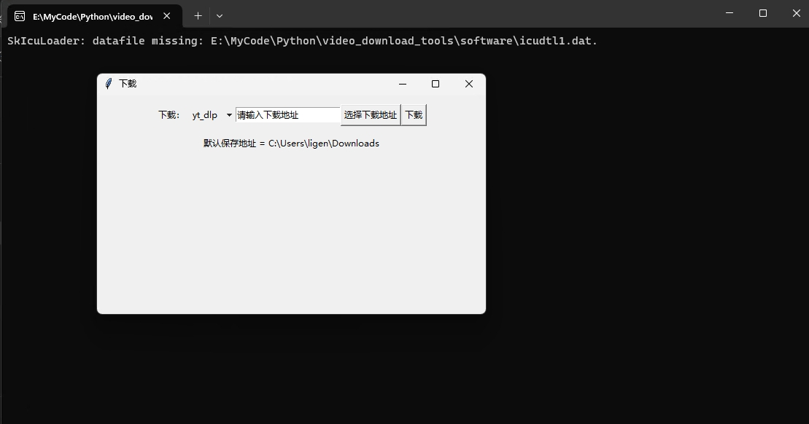
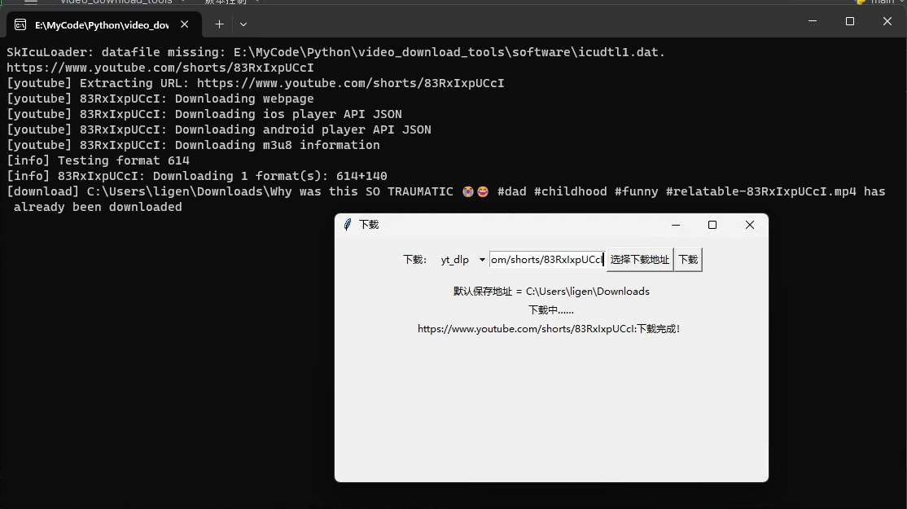

# 油土鳖小工具

四五年前写的一个油土鳖下载工具，现在还陆续有人想要地址，想了想，抽一个下午的空，把这个项目重构下，优化下页面以及下载方法。
解决下Windows10以上可能会出现的无法使用的问题，顺便加上一些下载方法。

# 使用方式（就想用，不想编程）：

## 下载地址
下载本库中的`software/video_download_tools.exe`文件，放到本地任意目录下。
[下载地址](software/video_download_tools.exe)

## 使用方法

开箱即用，三步即可完事儿：下载软件，填入需下载视频地址，然后点击下载就over。

点击下载的软件，直接运行即可出现如下页面：


填入需要下载的链接，选择下载文件存储目录（默认是系统的下载文件），点击下载即可：


后面的命令窗会显示后台的执行命令，如果报错可以自行简单排查。

    注意：虽然这个是有土鳖下载器，当实际上是可以下载很多网站的视频的，比如B站，抖音，快手等等。
    所以，如果你有需要，可以把链接直接丢进去尝试下载。

# 项目原理与使用方式（代码修改）

## 项目逻辑
用pyside2画页面，用you-get/youtube-dl/yt_dlp下载视频，用ffmpeg合并视频，用pyinstaller打包成exe。

## 项目下载与部署

### 环境安装
首先需要下载本仓库：
```bash
git clone https://github.com/ligenxun/video_download_tools
cd video_download_tools
```
然后使用 pip 安装依赖：
```bash
pip install -r requirements.txt
```

### 运行
```bash
python run main.py
```
或者直接执行main.py文件。
代码很简单，而且都有注视，可以自行修改。

## 封装的下载工具

有提示窗口的模式（现在使用方式）：
```bash
pyinstaller -F main.py
```
无提示窗口的模式（如有需要可以自行封装）：
```bash
pyinstaller -F -w main.py
```

